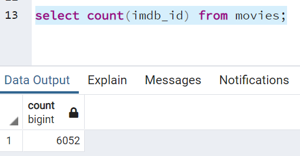
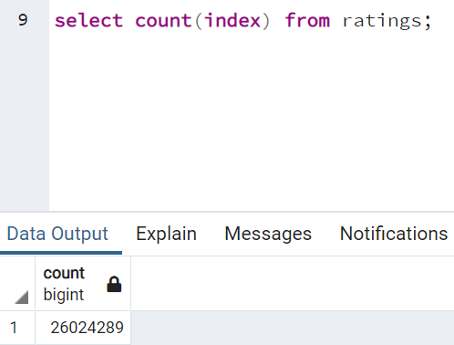

# Movies-ETL

### **Objective and Purpose**

The objective of this project is to learn **_ETL_** (Extract, Transform and Learn) to create a data pipeline. We helped Amazing Prime (a platform for streaming moves and tv shows) video team develop an algorithm that would predict which low budget movies would some day become popular. Amazing Prime wants to obtain the streaming right at a lower cost for these low budget movies before they become popular. The company is sponsoring a "hackathon" that will include the local coding community to predict the popular movies from a clean set of a large movie database. We helped Britta, a member of the Amazing Prime video team with creating a clean, easily readable databases for the hackathon.

 We imported the movie information from two sources: (1) scraped webpages from Wikepedia and Kaggle movies metadata for movies staritng from 1990, (2) ratings data from MovieLens website. We extracted the datasets, transform it in to one clean dataset and then load the dataset into a SQL table. We used Python and Pandas to perform data wrangling and then PostgreSQL to store our data. 

 ### **Analysis**

 We performed the following steps for this project. For **_Deliverable 1_**, **_2_** and **_3_** we extracted and transformed data from _wikipedia-movies.json_ , _Kaggle meta-data.csv_ and _ratings.csv_. The codes for extraction and cleaning are written in the files, *ETL_function_test.ipynb*, *ETL_clean_wiki_movies.ipynb*, *ETL_clean_kaggle_data.ipynb*. For **_Deliverable 4_** the code for the merged data to load in PostgreSQL database is in written in *ETL_create_database.ipynb*.
 
 #### **1. Extract**

We downloaded the data from wikipedia-movies.json. We also downloaded the ratings data from Kaggle.com website that contains a massive movies ratings data from MovieLens. We used the *movies_metadat.csv* and ratings.csv from the downloaded data. 

#### **2. Transform**

 We transformed the data using Python and Pandas using an iterative process, using the functions; lambda functions, list comprehension, regular expressions (regex). We removed duplicates and mostly null columns. We parsed and converted the data from (1) Box office, (2) Budget, (3) Release date, (4) Running time as needed from Wiki JSON data and the Kaggle meta data. We merged the Wikipedia and Kaggle metadata using inner join on *imdb_id*. We made sure that there was a consistency in the movies information and there were no duplicates. Finally, we transformed and merged Rating data with the rest. We created two tables, **movies** and **ratings** in pgAdmin database. 

#### **3. Load**

We loaded the cleaned and merged data from Pandas into PostgreSQL database for the use of hackathon members. We created a Database in pgAdmin. To ensure that we got the correct number of rows, we queried the number of rows in the table _movies_ and took a screenshot (Fig. 1). We also counted the number of rows in _ratings_ table. The query also showed that the number of rows in the _ratings_ table is 26,024,289 (Fig. 2).

### **Conclusion**

We were able to Extract (**E**) a large movie data set from different source in different format; We Transformed (**T**) the data so that it is consistent and cleaned any corrupt; Finally, we Loaded (**L**) the data in a SQL database. We created a table of _movies_ and _ratings_ as shown below. The data is ready for the Amazing hackathon participants. 

 

**Fig 1.** The figure shows the number of rows in the movies table after the cleaned and merged data is loaded in the PostgreSQL database. 

**Fig 2.** The figure shows the number of rows in the ratings table after cleaned and merged data is loaded in the PostgresSQL database. 
